# Priority and Replan Pipeline

Status: design recommendation, not yet wired into the solver or UI.

This document challenges the initial handwritten queue and replaces it with a
workflow grounded in the 18 September SMRT track-access consultation. The
consultation is operator evidence, not an official LTA policy specification;
garbled transcript terms and exact figures must not be presented as confirmed
policy.

## Decision

Do not implement the sketch as one permanent category-sorted queue.

Use category priority only as a configurable policy default inside a larger
pipeline. Safety, deferment risk, readiness, hard railway constraints, locked
work, and human approval can all override a category label. The deterministic
solver and validator remain the only feasibility authority. AI may structure
an operator request and explain a checked result, but it cannot declare a plan
feasible or publish it.

## Why the original sketch needs revision

1. `cancelled` and `deferred` are lifecycle states, not intrinsic work types. A
   cancelled project must not automatically outrank safety-critical preventive
   maintenance merely because it entered the cancelled queue.
2. `defect` is not enough to establish urgency. The consultation made safety
   consequence the dominant factor; a low-risk defect and an accident-critical
   condition alert should not receive the same band.
3. Closest end date is too weak. Rank by remaining slack against the latest
   permissible completion, required workload, recurrence window, and available
   access. A large job with an apparently later date can be more urgent.
4. Sorting cannot prove that a schedule works. Location supply, buffers,
   predecessors, possession mix, workfront limits, ECLO rules, and locked work
   must be checked by code.
5. Cancellation is not instant reallocation. The operator described cancelled
   work returning as full workload to a later planning cycle to compete again.
6. Deferment needs a risk limit. Preventive work can move within a window, but
   repeated deferment eventually makes it mandatory after risk assessment.
7. The sketch has no proposal version, human approval, or stale-plan state.
   Real changes after approval must invalidate the affected proposal and require
   a new checked decision.
8. The sketch treats execution as terminal. Real work can be stopped at the
   last moment by urgent defects, monitoring alerts, access loss, or weather;
   interrupted work may re-enter at full workload.

## Recommended system flow

Each large labelled group below is one main step. The smaller boxes inside it
show exactly what happens during that step.

```mermaid
graph TB
    start(["New job or changed condition"])

    subgraph receive["Step 1: Receive the information"]
        direction LR
        receive1["Read the form, file or alert"] --> receive2["Use the standard field names"] --> receive3["Save the source and time"]
    end

    start --> receive1
    receive3 --> complete{"Is the required information complete?"}
    complete -->|No| missing1["List the missing information"]
    missing1 --> missing2["Ask the operator to provide it"]
    missing2 --> receive1

    subgraph understand["Step 2: Understand the job"]
        direction LR
        understand1["Mark it as maintenance or project work"] --> understand2["Record why it entered the plan"] --> understand3["Record its status, safety level and due dates"]
    end

    complete -->|Yes| understand1
    understand3 --> holdcheck{"Is there a known reason to hold it outside planning?"}

    subgraph blocked["If blocked: record a useful answer"]
        direction LR
        blocked1["Name the exact reason"] --> blocked2["State the first known recovery time"] --> blocked3["State the smallest safe recovery action"]
    end

    holdcheck -->|Yes| blocked1
    blocked3 --> wait["Wait until the missing condition changes"]
    wait --> holdcheck

    subgraph order["Step 3: Put ready jobs in a clear order"]
        direction LR
        order1["Safety and mandatory work first"] --> order2["Then overdue or repeatedly deferred work"] --> order3["Then maintenance, stated priority, time left and delay cost"] --> order4["Use readiness, plan changes and job ID only to break later ties"]
    end

    holdcheck -->|No| order1

    choose{"Are we making a new plan or fixing a changed plan?"}
    order4 --> choose

    subgraph makeplan["Step 4A: Make a new plan"]
        direction LR
        make1["Take the ready jobs in order"] --> make2["Try a legal week, access night and location"] --> make3["Keep trying until all required work is placed"]
    end

    subgraph changeplan["Step 4B: Fix a changed plan"]
        direction LR
        change1["Keep active and unaffected work fixed"] --> change2["Reconsider only the changed job and work that depends on it"] --> change3["Try legal weeks closest to the old plan"]
    end

    choose -->|New plan| make1
    choose -->|Changed plan| change1
    make3 --> check1
    change3 --> check1

    subgraph check["Step 5: Check the plan with separate code"]
        direction LR
        check1["Check every hard railway rule"] --> check2["Check every activity still has its full workload"] --> check3["Produce exact failures and warnings"]
    end

    check3 --> pass{"Did every hard rule pass?"}
    pass -->|No| retry{"Is one more safe repair allowed?"}
    retry -->|Yes| repair1["Move or swap a small number of assignments"]
    repair1 --> check1

    subgraph failed["If no valid plan is found"]
        direction LR
        failed1["Show the rules that block the plan"] --> failed2["Show which lock or input must change"] --> failed3["Send the decision to the planner"]
    end

    retry -->|No| failed1

    subgraph explain["Step 6: Explain the checked plan"]
        direction LR
        explain1["Show the assigned work"] --> explain2["Show every move, delay, warning and cost change"] --> explain3["Say that the separate checker proved feasibility"]
    end

    pass -->|Yes| explain1
    failed3 --> review1
    explain3 --> review1

    subgraph review["Step 7: Human review"]
        direction LR
        review1["Planner checks the result and trade-offs"] --> review2["Planner accepts it or changes an input"]
    end

    review2 --> approved{"Did the planner approve this version?"}
    approved -->|No, change input| receive1

    subgraph publish["Step 8: Publish and protect the approved plan"]
        direction LR
        publish1["Give the plan a version number"] --> publish2["Save who approved it and when"] --> publish3["Lock active and approved work"]
    end

    approved -->|Yes| publish1

    subgraph run["Step 9: Carry out the work"]
        direction LR
        run1["Do the final safety and access check"] --> run2["Start the approved work"] --> run3["Record what happened"]
    end

    publish3 --> run1
    run3 --> outcome{"What happened?"}
    outcome -->|Completed| done["Record completion and close the audit trail"]
    outcome -->|Cancelled before start| cancel["Record the cause and return the full workload"]
    outcome -->|Interrupted| interrupt["Record completed work and return all unfinished work"]
    outcome -->|Deferred| defer["Record the reason, owner, new date and deferment count"]
    cancel --> receive1
    interrupt --> receive1
    defer --> receive1

    publish3 --> changed{"Did an important input change?"}
    changed -->|Yes| change1

    classDef input fill:#d3f9d8,stroke:#2f9e44,color:#1b4332
    classDef decision fill:#ffe3e3,stroke:#c92a2a,color:#7f1d1d
    classDef process fill:#e5dbff,stroke:#5f3dc4,color:#3b2f72
    classDef action fill:#ffe8cc,stroke:#d9480f,color:#7c2d12
    classDef output fill:#c5f6fa,stroke:#0c8599,color:#155e75
    class start,receive1,receive2,receive3,understand1,understand2,understand3 input
    class complete,holdcheck,choose,pass,retry,approved,outcome,changed decision
    class order1,order2,order3,order4,make1,make2,make3,change1,change2,change3,check1,check2,check3 process
    class missing1,missing2,blocked1,blocked2,blocked3,wait,repair1,failed1,failed2,failed3,cancel,interrupt,defer action
    class explain1,explain2,explain3,review1,review2,publish1,publish2,publish3,run1,run2,run3,done output
```

### What the main terms mean

**Ordered list of ready jobs**

This replaces the phrase `ranked candidate set`. A candidate is simply a job
that has enough information and is allowed to enter planning. The system puts
those jobs in an order so the scheduler knows which one to try first.

The desired operations order compares one rule at a time. The first rule that
separates two jobs decides which comes first:

1. urgent safety or mandatory work;
2. work at its deferment limit or recurrence deadline;
3. maintenance before project work by default;
4. the supplied contract and activity priority;
5. the job with less usable time left after considering its workload and the
   access nights still available;
6. the job that would create the larger delay penalty;
7. the job that is ready when a scarce access opportunity exists;
8. during a replan, the option that changes less approved work;
9. the stable activity ID, so a true tie always has the same answer.

This ordering only tells the scheduler what to try first. It never makes an
unsafe placement legal. It is a design recommendation for the wider operations
workflow. The current PS1 solver uses its existing constraint-tightness order
and the published scenario score, so this policy must not be presented as
already implemented.

**Automatic allocation**

This replaces the phrase `deterministic allocate`. Fixed code tries to assign
each job a legal week, access night, location, possession group and ECLO choice.
It checks the published rules while building the plan. With the same inputs and
settings, it is designed to give the same answer. AI does not choose whether a
placement is legal. A separate validator checks the completed plan before it
can move to human review or CSV release.

**Change-as-little-as-possible replan**

This replaces the phrase `minimal-churn replan`. When one job is blocked or
delayed, the current replan code keeps every unaffected job fixed. It only
reconsiders that job and jobs that depend on it, then tries legal weeks closest
to their old weeks. This is a narrow recovery method, not proof that it found
the mathematically smallest possible number of changes.

**Useful blocked result**

A blocked result should contain three things: the exact reason, the first known
time the reason may clear, and the smallest safe action that could clear it.
Examples include waiting for a predecessor, moving to the first week with a
free workfront slot, or changing an explicit lock. If the data does not say when
the condition clears, the result must say `recovery unknown`.

## Data model: separate identity, state and urgency

Do not overload one `category` field. Keep these dimensions separate:

| Dimension | Representative values | Purpose |
| --- | --- | --- |
| Work class | maintenance, project | Applies the consultation's default maintenance-over-project policy. |
| Maintenance type | corrective, preventive, renewal, inspection | Describes the work itself. |
| Trigger | planned cycle, observed defect, condition alert, carry-over, project milestone | Preserves why the request exists. |
| Lifecycle state | draft, proposed, approved, ready, active-locked, complete, cancelled, deferred, stale | Prevents status from becoming a fake priority category. |
| Safety band | critical, safety-related, service-impacting, routine | First policy discriminator; requires evidence and provenance. |
| Time obligation | earliest start, latest completion, recurrence due, contract date | Supports slack rather than raw end-date sorting. |
| Deferment | count, reason, risk owner, latest return date, limit | Makes escalation auditable. |
| Readiness | explicit operator hold, approval or equipment state, only when supplied | Keeps known unavailable work outside planning without inventing missing data. |
| PS1 team capacity | `number_of_workfronts` | Hard limit on concurrent activities for the same contract and activity type on one access night. |
| Change control | plan version, locked flag, source event, approval state | Supports safe replanning and audit. |

**Manpower boundary (PS1 official)**

Manpower is represented only indirectly by `number_of_workfronts`. Rule 8 in
the [official PS1 brief](https://github.com/aochinwen/NebulaX-Hackathon-ProblemStatement/blob/966c976005db2e3e40a691cff268fdb8f396a5df/PS1/PS1_README.md#24-operating-rules-strict-constraints-vs-optimization-targets)
uses it as a hard cap on the number of distinct activities that the same
contract and activity type can run on one access night. It is best explained as
the number of concurrent work teams available under that contract/type.

The eight supplied CSV files do not contain named workers, headcount, shift
rosters, leave, certifications or skill availability. The hidden validator can
check the workfront cap, but it cannot check whether a particular person or
specialist crew is free. A future operational version may accept that data, but
the current product must label it as an extra input rather than a PS1 rule.

**Blocked reasons**

Every blocked item must name the actual missing condition, for example an
unfinished predecessor, no legal workfront slot, an explicit operator hold, or
a locked assignment that cannot move. It should also state the first known
recovery time and smallest safe recovery action. If either is not supported by
the data, state that it is unknown.

## State-transition rules

- `complete`: terminal, with actual completion recorded.
- `cancelled`: retain cause and prior plan version; restore the full required workload; return to the next decision cycle unless an urgent rule triggers an immediate replan.
- `deferred`: require reason, risk owner, defer-until/latest-return date, and deferment count; escalate when the allowed limit is reached.
- `active-locked`: never move automatically during recovery.
- `stale`: an approved proposal whose decision-relevant inputs changed; it cannot be published or executed without revalidation and reapproval.

## Best hackathon slice

Do not build the full enterprise workflow before the deadline. The highest-value demonstration is:

1. Solve the supplied PS1 instance and independently validate it.
2. Mark the plan approved/versioned.
3. Inject one operator-grounded disruption: a morning condition alert or urgent defect removes an access opportunity from tonight's plan.
4. Preserve active/locked and unaffected work, replan only the impacted chain, and validate again.
5. Show exactly what moved, what was deferred, why the policy ranked it that way, the cost/churn change, and whether human approval is still needed.
6. Refuse CSV release if the independent validator fails.
7. Present the AI risk mitigation explicitly: AI parses/explains; deterministic code checks; a human approves the version.

This moves the product beyond merely answering the dataset while keeping the existing solver/validator/exporter as the competition-safe core.

## Evidence boundary

Primary context: the `NEBULA X, Source, SMRT Track Access Interview Transcript,
18 Sep 2026` page in the team's Notion Brain, backed by the retained local SRT.
The consultation supports the workflow direction above, but it does not prove
exact SMRT policy, system integration, or operator endorsement of this product.
