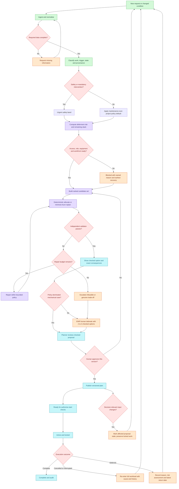

# Priority and Replan Pipeline

Status: design recommendation, not yet wired into the solver or UI.

This document challenges the initial handwritten queue and replaces it with a
workflow grounded in the 18 September SMRT track-access consultation. The
consultation is operator evidence, not an official LTA policy specification;
garbled transcript terms and exact figures must not be presented as confirmed
policy.

## Decision

Do not implement the sketch as one permanent category-sorted queue.

Use category priority only as a configurable policy default inside a larger
pipeline. Safety, deferment risk, readiness, hard railway constraints, locked
work, and human approval can all override a category label. The deterministic
solver and validator remain the only feasibility authority. AI may structure
an operator request and explain a checked result, but it cannot declare a plan
feasible or publish it.

## Why the original sketch needs revision

1. `cancelled` and `deferred` are lifecycle states, not intrinsic work types. A
   cancelled project must not automatically outrank safety-critical preventive
   maintenance merely because it entered the cancelled queue.
2. `defect` is not enough to establish urgency. The consultation made safety
   consequence the dominant factor; a low-risk defect and an accident-critical
   condition alert should not receive the same band.
3. Closest end date is too weak. Rank by remaining slack against the latest
   permissible completion, required workload, recurrence window, and available
   access. A large job with an apparently later date can be more urgent.
4. Sorting cannot establish schedulability. Location supply, buffers,
   precedence, possession mix, workfronts, engineering hours, readiness, and
   locked work must be checked by deterministic code.
5. Cancellation is not instant reallocation. The operator described cancelled
   work returning as full workload to a later EWR cycle to compete again.
6. Deferment needs a risk limit. Preventive work can move within a window, but
   repeated deferment eventually makes it mandatory after risk assessment.
7. The sketch has no proposal version, human approval, or stale-plan state.
   Real changes after approval must invalidate the affected proposal and require
   a new checked decision.
8. The sketch treats execution as terminal. Real work can be stopped at the
   last moment by urgent defects, monitoring alerts, access loss, or weather;
   interrupted work may re-enter at full workload.

## Recommended system flow

## Data model: separate identity, state and urgency

Do not overload one `category` field. Keep these dimensions separate:

| Dimension | Representative values | Purpose |
| --- | --- | --- |
| Work class | maintenance, project | Applies the consultation's default maintenance-over-project policy. |
| Maintenance type | corrective, preventive, renewal, inspection | Describes the work itself. |
| Trigger | planned cycle, observed defect, condition alert, carry-over, project milestone | Preserves why the request exists. |
| Lifecycle state | draft, proposed, approved, ready, active-locked, complete, cancelled, deferred, stale | Prevents status from becoming a fake priority category. |
| Safety band | critical, safety-related, service-impacting, routine | First policy discriminator; requires evidence and provenance. |
| Time obligation | earliest start, latest completion, recurrence due, contract date | Supports slack rather than raw end-date sorting. |
| Deferment | count, reason, risk owner, latest return date, limit | Makes escalation auditable. |
| Readiness | access authority, power/protection, configured person-in-charge role, workfront, equipment, engineering train | Blocks impossible work before ranking. |
| Change control | plan version, locked flag, source event, approval state | Supports safe replanning and audit. |

## Ranking policy

Ranking selects which feasible candidate to try first; it never overrides hard
constraints. Use a deterministic lexicographic key, with lower values preferred:

1. safety/mandatory intervention band;
2. deferment limit reached or recurrence window at risk;
3. maintenance before project as the default policy, unless a configured rule
   explicitly says otherwise;
4. supplied internal/contract priority;
5. remaining slack after accounting for required work and available access;
6. contractual overrun impact;
7. readiness and scarce-resource opportunity;
8. schedule churn for replans;
9. stable task identifier.

Important consequences:

- Previously cancelled work gains urgency through lost access, reduced slack,
  and deferment history; cancellation alone is not universal priority 2.
- Deferred work escalates as its risk/recurrence limit approaches; it is not
  permanently tied with all preventive work.
- A safety-critical preventive inspection can outrank a low-severity defect.
- A project remains lower than maintenance by default, matching the
  consultation, but the rule stays configurable and visible.

## State-transition rules

- `complete`: terminal, with actual completion recorded.
- `cancelled`: retain cause and prior plan version; restore the full required
  workload; return to the next decision cycle unless an urgent rule triggers an
  immediate replan.
- `deferred`: require reason, risk owner, defer-until/latest-return date, and
  deferment count; escalate when the allowed limit is reached.
- `active-locked`: never move automatically during recovery.
- `stale`: an approved proposal whose decision-relevant inputs changed; it
  cannot be published or executed without revalidation and reapproval.

## Best hackathon slice

Do not build the full enterprise workflow before the deadline. The highest-value
demonstration is:

1. Solve the supplied PS1 instance and independently validate it.
2. Mark the plan approved/versioned.
3. Inject one operator-grounded disruption: a morning condition alert or urgent
   defect removes an access opportunity from tonight's plan.
4. Preserve active/locked and unaffected work, replan only the impacted chain,
   and validate again.
5. Show exactly what moved, what was deferred, why the policy ranked it that
   way, the cost/churn change, and whether human approval is still needed.
6. Refuse CSV release if the independent validator fails.
7. Present the AI risk mitigation explicitly: AI parses/explains; deterministic
   code checks; a human approves the version.

This moves the product beyond merely answering the dataset while keeping the
existing solver/validator/exporter as the competition-safe core.

## Evidence boundary

Primary context: `NEBULA X — Source — SMRT Track Access Interview Transcript —
18 Sep 2026` in the team's Notion Brain, backed by the retained local SRT. The
consultation supports the workflow direction above, but it does not prove exact
SMRT policy, system integration, or operator endorsement of this product.
