# Priority and Replan Pipeline

Status: design recommendation, not yet wired into the solver or UI.

This document challenges the initial handwritten queue and replaces it with a
workflow grounded in the 18 September SMRT track-access consultation. The
consultation is operator evidence, not an official LTA policy specification;
garbled transcript terms and exact figures must not be presented as confirmed
policy.

## Decision

Do not implement the sketch as one permanent category-sorted queue.

Use the values already supplied in the files. `activity_type` is `Renewal` or
`Construction`. Do not rename those values to maintenance or project because
the official repository does not define that mapping. The brief says in-house
maintenance has already reserved its nights before the remaining
`LOCATION_SUPPLY` is passed to this scheduler.

Add user-managed status on top of the supplied data. If an activity cannot
proceed, the user selects it, enters a reason, and moves it to the Cancelled,
Interrupted, or Deferred list. It is not placed automatically again until a
user returns it to planning. Fixed scheduling code and the independent
validator remain the feasibility authority. AI may help read or explain an
operator request, but it cannot declare a plan valid or publish it.

## Why the original sketch needs revision

1. `cancelled`, `interrupted`, and `deferred` are user-managed activity states.
   They are not values in the supplied `activity_type` column.
2. The supplied `activity_type` values are `Renewal` and `Construction`.
   `access_type` is separate and contains `PM`, `PC`, or `C`, which describe
   possession roles rather than whether the work is maintenance or project.
3. Planned start, planned completion, and contract completion dates already
   come from the files. The user does not need to enter a due date as the cause
   for cancellation or interruption.
4. Sorting cannot prove that a schedule works. Location supply, buffers,
   predecessors, possession mix, workfront limits, ECLO rules, and locked work
   must be checked by code.
5. Cancellation is not instant reallocation. The operator described cancelled
   work returning as full workload to a later planning cycle to compete again.
6. Deferred work needs a return date. It returns to the ready list when that
   date arrives, not because the system labels it overdue.
7. The sketch has no proposal version, human approval, or stale-plan state.
   Real changes after approval must invalidate the affected proposal and require
   a new checked decision.
8. The sketch treats execution as terminal. Real work can be stopped at the
   last moment by urgent defects, monitoring alerts, access loss, or weather;
   all unfinished work must return to planning.

## Recommended system flow

Each large labelled group below is one main step. The smaller boxes inside it
show exactly what happens during that step.

```mermaid
graph TB
    start(["New input files or a user status change"])

    subgraph receive["Step 1: Load the supplied information"]
        direction LR
        receive1["Load the eight PS1 CSV files"] --> receive2["Read Renewal or Construction from activity_type"] --> receive3["Read workload, planned start, predecessor and priorities"]
    end

    start --> receive1
    receive3 --> complete{"Did all required files and fields load?"}
    complete -->|No| missing1["List the missing file or field"]
    missing1 --> missing2["Ask the user to correct the input"]
    missing2 --> receive1

    subgraph status["Step 2: Record work that cannot proceed"]
        direction LR
        status1["User selects the activity"] --> status2["User enters the reason"] --> status3{"Which list should it enter?"}
    end

    complete -->|Yes| statuscheck{"Did the user mark an activity unable to proceed now?"}
    statuscheck -->|Yes| status1
    status3 -->|Not started| cancelled["Cancelled list: full workload waits"]
    status3 -->|Started| interrupted["Interrupted list: unfinished workload waits"]
    status3 -->|Deferred| deferred["Deferred list until its return date"]
    cancelled --> wait["Keep it out of automatic scheduling until a user returns it"]
    interrupted --> wait
    deferred --> returncheck{"Has its return date arrived?"}
    returncheck -->|No| deferred

    subgraph order["Step 3: Put ready jobs in a clear order"]
        direction LR
        order1["Deferred work whose return date has arrived"] --> order2["Then lower contract_priority number"] --> order3["Then lower activity_priority number"] --> order4["If still tied, sort by activity_id"]
    end

    statuscheck -->|No| order1
    returncheck -->|Yes| order1
    wait --> userreturn{"Did a user return the activity to planning?"}
    userreturn -->|No| wait
    userreturn -->|Yes| order1

    choose{"Are we making a new plan or fixing a changed plan?"}
    order4 --> choose

    subgraph makeplan["Step 4A: Make a new plan"]
        direction LR
        make1["Take the next ready activity"] --> make2["Try a week allowed by every PS1 rule"] --> make3["Assign its access night, location and sharing group"] --> make4["Continue until every full workload is placed"]
    end

    subgraph changeplan["Step 4B: Fix a changed plan"]
        direction LR
        change1["Keep active and unaffected work fixed"] --> change2["Reconsider only the changed activity and dependent activities"] --> change3["Try allowed weeks closest to the old plan"]
    end

    choose -->|New plan| make1
    choose -->|Changed plan| change1
    make4 --> check1
    change3 --> check1

    subgraph check["Step 5: Check the plan with separate code"]
        direction LR
        check1["Check every hard railway rule"] --> check2["Check every activity still has its full workload"] --> check3["Produce exact failures and warnings"]
    end

    check3 --> pass{"Did every hard rule pass?"}
    pass -->|No| retry{"Is one more safe repair allowed?"}
    retry -->|Yes| repair1["Move or swap a small number of assignments"]
    repair1 --> check1

    subgraph failed["If no valid plan is found"]
        direction LR
        failed1["Show the rules that block the plan"] --> failed2["Show which lock or input must change"] --> failed3["Send the decision to the planner"]
    end

    retry -->|No| failed1

    subgraph explain["Step 6: Explain the checked plan"]
        direction LR
        explain1["Show the assigned work"] --> explain2["Show every move, delay, warning and score change"] --> explain3["Show local validator result: zero hard-rule failures"]
    end

    pass -->|Yes| explain1
    failed3 --> review1
    explain3 --> review1

    subgraph review["Step 7: Human review"]
        direction LR
        review1["Planner checks the result and trade-offs"] --> review2["Planner accepts it or changes an input"]
    end

    review2 --> approved{"Did the planner approve this version?"}
    approved -->|No, change input| receive1

    subgraph publish["Step 8: Publish and protect the approved plan"]
        direction LR
        publish1["Create an internal version number for machine reference"] --> publish2["Show approval date, time and approver in the saved document"] --> publish3["Lock active and approved work"]
    end

    approved -->|Yes| publish1

    subgraph run["Step 9: Carry out the work"]
        direction LR
        run1["Do the final safety and access check"] --> run2["Start the approved work"] --> run3["Record what happened"]
    end

    publish3 --> run1
    run3 --> outcome{"What happened?"}
    outcome -->|Completed| done["Record completion and close the audit trail"]
    outcome -->|Cannot continue| status1

    publish3 --> changed{"Did an important input change?"}
    changed -->|Yes| change1

    classDef input fill:#d3f9d8,stroke:#2f9e44,color:#1b4332
    classDef decision fill:#ffe3e3,stroke:#c92a2a,color:#7f1d1d
    classDef process fill:#e5dbff,stroke:#5f3dc4,color:#3b2f72
    classDef action fill:#ffe8cc,stroke:#d9480f,color:#7c2d12
    classDef output fill:#c5f6fa,stroke:#0c8599,color:#155e75
    class start,receive1,receive2,receive3,status1,status2 input
    class complete,statuscheck,status3,returncheck,userreturn,choose,pass,retry,approved,outcome,changed decision
    class order1,order2,order3,order4,make1,make2,make3,make4,change1,change2,change3,check1,check2,check3 process
    class missing1,missing2,cancelled,interrupted,deferred,wait,repair1,failed1,failed2,failed3 action
    class explain1,explain2,explain3,review1,review2,publish1,publish2,publish3,run1,run2,run3,done output
```

### What the main terms mean

**What the Step 3 rectangles mean**

Each rectangle is an ordering step, not a yes-or-no decision. The system compares
two ready activities using one rectangle at a time:

1. A deferred activity whose return date has arrived enters the ready list.
2. Lower `contract_priority` number comes first, so priority 1 beats 2 and 3.
3. If the contract priority ties, lower `activity_priority` number comes first.
4. If both priorities tie, sort by `activity_id`. This final rectangle gives the
   same order every time and has no business meaning beyond breaking a tie.

This is the requested product ordering. The current solver still uses its
existing constraint-tightness order, so do not present this Step 3 sequence as
implemented until the solver is changed and retested.

**Automatic allocation**

Fixed code tries to assign each activity an allowed week, access night,
location, possession group and ECLO choice.
It checks the published rules while building the plan. With the same inputs and
settings, it is designed to give the same answer. AI does not choose whether a
placement is legal. A separate validator checks the completed plan before it
can move to human review or CSV release.

**Week allowed by every PS1 rule**

This replaces the phrase `legal week`. A week is allowed only when the proposed
placement passes all applicable official rules:

1. the full workload is still scheduled;
2. the activity does not start before `planned_start_date`;
3. its predecessor finishes in a strictly earlier week;
4. location closures, buffers, and Live opposite-bound or interchange closures
   do not conflict;
5. each possession uses an allowed `PM`, `PC`, and `C` mix;
6. only activities in the same location, week, and `co_share_group` share one
   possession;
7. the contract and activity type stay within the weekly access-night cap;
8. the contract and activity type stay within the `number_of_workfronts` cap on
   each access night;
9. the location stays within the scenario's supply rule;
10. ECLO obeys the scenario rule, including Scenario C's two-week continuous
    window per line.

Scenario A forbids ECLO and excess supply. Scenario B forbids finishing after
the planned completion date. Scenario C permits only its published limited
supply flexibility. The official brief describes non-overlapping buffers as a
hard rule, but the supplied zero-violation sample conflicts with the literal
geometry. The app still reports those disputed non-Live overlaps as warnings
and keeps Live mirror conflicts hard until the official validator or organiser
settles the meaning.

**Change-as-little-as-possible replan**

This replaces the phrase `minimal-churn replan`. When one job is blocked or
delayed, the current replan code keeps every unaffected job fixed. It only
reconsiders that job and jobs that depend on it, then tries allowed weeks closest
to their old weeks. This is a narrow recovery method, not proof that it found
the mathematically smallest possible number of changes.

**Not scheduled now**

This replaces the phrase `hold it outside planning`. The selected activity is
kept in a separate Cancelled, Interrupted, or Deferred list and is excluded from
automatic placement. The saved row includes the user-entered reason, the prior
plan version, and any defer-until date. It returns only when a user chooses
`Return to planning`, or when a deferred return date arrives and a user confirms
the return.

**What the local validator result means**

`Zero hard-rule failures` means our independent checker found no breach of the
rules it implements for that candidate schedule. It is stronger than an AI
explanation because it comes from separate code. It is not proof that the
schedule will pass the organisers' unavailable hidden reference validator.

**Plan record and version number**

The system stores an internal version number so code, logs, approvals, and later
replans can refer to one exact plan. The saved human-facing document shows the
approval date, approval time, and approver name. The machine reference and the
human audit details serve different purposes and both point to the same plan.

## Data model: separate identity, state and urgency

Do not overload one `category` field. Keep these dimensions separate:

| Dimension | Representative values | Purpose |
| --- | --- | --- |
| Activity type from file | Renewal, Construction | Uses the exact `activity_type` value without inferring maintenance or project. |
| Possession role from file | PM, PC, C | Uses `access_type` to apply the legal possession mix. |
| Nature from file | Live, Non-live Consist, Non-live Others | Determines buffer and closure behaviour. |
| User-managed state | ready, cancelled, interrupted, deferred, active, complete | Controls whether an activity is available for automatic scheduling. |
| User status details | reason, selected status, defer-until date | Explains why work left the ready list and when it may return. |
| Timing from file | planned start, planned completion, contract completion | Applies official start, scenario and scoring rules without asking the user to enter a new due cause. |
| Priority from file | contract priority, activity priority | Orders ready work using the supplied priority numbers. |
| PS1 team capacity | `number_of_workfronts` | Hard limit on concurrent activities for the same contract and activity type on one access night. |
| Change control | plan version, locked flag, source event, approval state | Supports safe replanning and audit. |

**Manpower boundary (PS1 official)**

Manpower is represented only indirectly by `number_of_workfronts`. Rule 8 in
the [official PS1 brief](https://github.com/aochinwen/NebulaX-Hackathon-ProblemStatement/blob/966c976005db2e3e40a691cff268fdb8f396a5df/PS1/PS1_README.md#24-operating-rules-strict-constraints-vs-optimization-targets)
uses it as a hard cap on the number of distinct activities that the same
contract and activity type can run on one access night. It is best explained as
the number of concurrent work teams available under that contract/type.

The eight supplied CSV files do not contain named workers, headcount, shift
rosters, leave, certifications or skill availability. The hidden validator can
check the workfront cap, but it cannot check whether a particular person or
specialist crew is free. A future operational version may accept that data, but
the current product must label it as an extra input rather than a PS1 rule.

**Dates are inputs, not user-entered causes**

The user only enters the reason an activity cannot proceed. The application
already reads `planned_start_date`, `planned_completion_date`, and
`contract_completion_date` from the CSV files. Those dates remain necessary
because the official scenarios and score use them, but they are not cancellation
or interruption reasons.

## State-transition rules

- `complete`: terminal, with actual completion recorded.
- `cancelled`: work has not started. Save the user-entered reason and prior plan
  version. Keep the full workload in the Cancelled list until a user returns it.
- `interrupted`: work started but could not finish. Save the reason and completed
  work. Keep every unfinished access in the Interrupted list until a user
  returns it.
- `deferred`: save the reason and return date. When that date arrives, show it as
  due for return to the ready list.
- `active-locked`: never move automatically during recovery.
- `stale`: an approved proposal whose decision-relevant inputs changed; it cannot be published or executed without revalidation and reapproval.

## Best hackathon slice

Do not build the full enterprise workflow before the deadline. The highest-value demonstration is:

1. Solve the supplied PS1 instance and independently validate it.
2. Mark the plan approved/versioned.
3. Inject one operator-grounded disruption: a morning condition alert or urgent defect removes an access opportunity from tonight's plan.
4. Preserve active/locked and unaffected work, replan only the impacted chain, and validate again.
5. Show exactly what moved, what was deferred, the published score change, the
   local validator result, and whether human approval is still needed.
6. Refuse CSV release if the independent validator fails.
7. Present the AI risk mitigation explicitly: AI parses/explains; deterministic code checks; a human approves the version.

This moves the product beyond merely answering the dataset while keeping the existing solver/validator/exporter as the competition-safe core.

## Evidence boundary

Primary context: the `NEBULA X, Source, SMRT Track Access Interview Transcript,
18 Sep 2026` page in the team's Notion Brain, backed by the retained local SRT.
The consultation supports the workflow direction above, but it does not prove
exact SMRT policy, system integration, or operator endorsement of this product.
