# Project TAO UI User Flow

This is the standalone interface flow for a person using Project TAO. It
describes screens, visible states, user actions, and navigation. The backend
logic informs what the UI displays, but its solver and validator internals are
documented separately in `PRIORITY_AND_REPLAN_PIPELINE.md`.

Solid paths are the user-facing authority path. Yellow dashed nodes are
AI-assisted interface panels: they may propose a conversion, explain checked
evidence, or draft text, but they cannot accept an input, choose feasibility,
approve work, or unlock an export. A dashed AI path describes advisory
authority, not implementation status. Grey dashed nodes are planned UI
additions and must not be presented as implemented in the current localhost
build.

```mermaid
graph TB
    open(["User opens Project TAO"])
    welcome["Quick Welcome then Project TAO transition"]

    subgraph intake["Dataset intake"]
        direction TB
        upload["Upload workspace"]
        choose["Select or drop source files"]
        localcheck["Local check inspects filenames, tables and required columns"]
        canonical{"Does each dropped file already match a canonical CSV slot?"}
        manifest["File manifest shows Loaded or Waiting"]
        complete{"Are all eight required files loaded?"}
        missing["Keep Process dataset disabled and show missing filenames"]
        ready["Enable Process dataset"]
    end

    open --> welcome --> upload
    upload --> choose --> localcheck --> canonical
    canonical -->|Yes| manifest --> complete
    complete -->|No| missing --> choose
    complete -->|Yes| ready

    subgraph conversion["Manual filename mapping and AI-assisted content repair"]
        direction TB
        manualguide["Show unmatched files beside available 01–08 canonical slots"]
        userassign["User explicitly assigns each filename to a slot"]
        internalcopy["Create an internal correctly named copy; keep original unchanged"]
        contentgate["Deterministic schema and relationship validation"]
        contentpass{"Does the content pass?"}
        conversionoffer["Offer Gemini-assisted content repair"]
        disclosure["Show the provider, exact files and fields to send, and privacy notice"]
        consent{"Does the user explicitly consent to sending those files?"}
        aiconvert["AI maps and cleans the source into an untrusted eight-table draft"]
        mappingreview["Review every proposed mapping with source row and uncertainty"]
        ambiguity{"Are required values missing or ambiguous?"}
        usermapping["User corrects or confirms the proposed values"]
        draftgate["Deterministic schema gate checks the eight-table draft"]
        draftpass{"Did the draft pass every deterministic check?"}
        drafterrors["Show exact errors and keep Process dataset disabled"]
        acceptdraft["User accepts the checked draft into the file manifest"]
    end

    canonical -->|No| manualguide --> userassign --> internalcopy --> manifest
    ready --> contentgate --> contentpass
    contentpass -->|Yes| start
    contentpass -->|No| conversionoffer
    conversionoffer -.-> disclosure
    disclosure -.-> consent
    consent -.->|No| schemaerror
    consent -.->|Yes| aiconvert
    aiconvert -.-> mappingreview
    mappingreview -.-> ambiguity
    ambiguity -.->|Yes| usermapping
    ambiguity -.->|No| draftgate
    usermapping -.-> draftgate
    draftgate --> draftpass
    draftpass -->|No| drafterrors
    drafterrors -.-> mappingreview
    draftpass -->|Yes| acceptdraft --> manifest

    subgraph processing["Processing experience"]
        direction TB
        start["User selects Process dataset"]
        progress["Processing state locks editable controls"]
        terminal["Compact terminal shows intake, checks, sorting and policy progress"]
        processoutcome{"What result does the UI receive?"}
    end

    start --> progress --> terminal --> processoutcome

    subgraph inputerror["Input correction"]
        direction TB
        schemaerror["Error panel shows the exact file, field or row problem"]
        fixsource["User corrects the source file outside the app"]
        reupload["User uploads the corrected file set"]
    end

    processoutcome -->|Input rejected| schemaerror
    schemaerror --> fixsource --> reupload --> manifest

    subgraph results["Results workspace"]
        direction TB
        gallery["Result gallery shows one card for each official policy"]
        cardstate{"What is the card state?"}
        valid["Valid card shows score summary and zero hard violations"]
        blocked["Blocked card shows the checked failure and withholds export"]
        failed["Failed card shows the processing error without leaving a pending spinner"]
        resultchoice{"What does the user want to do?"}
        download["Download Access, Occupancy and Results CSV files"]
    end

    processoutcome -->|Policies settled| gallery --> cardstate
    cardstate -->|Valid| valid --> resultchoice
    cardstate -->|Validator blocked| blocked --> resultchoice
    cardstate -->|Processing failed| failed --> resultchoice
    resultchoice -->|Export a valid policy| download
    resultchoice -->|Change the dataset| choose

    subgraph replan["Disruption replan"]
        direction TB
        selectpolicy["User selects Use this result for disruption replan"]
        command["Enter one supported block or delay command"]
        replanrun["Replan state appears in the terminal"]
        replangate{"Did the checked replan pass?"}
        replansuccess["Show exact schedule changes, warnings and score effect"]
        replanblocked["Show hard violations and keep exports locked"]
        replanchoice{"What does the user do next?"}
        replanexport["Download the three replanned CSV files"]
    end

    resultchoice -->|Replan a valid policy| selectpolicy
    selectpolicy --> command --> replanrun --> replangate
    replangate -->|Yes| replansuccess --> replanchoice
    replangate -->|No| replanblocked --> replanchoice
    replanchoice -->|Export checked replan| replanexport
    replanchoice -->|Revise command| command
    replanchoice -->|Change source data| choose

    subgraph aiui["AI assistance panels"]
        direction TB
        ailaunch{"User asks AI for help?"}
        aiconfig{"Does the user consent to this specific Gemini request?"}
        aievidence["AI panel lists the evidence IDs it may read"]
        aiexplain["AI explains the checked error or result in plain English"]
        aisummary["AI drafts a stakeholder summary"]
        userreview["User reviews, edits, copies or rejects the draft"]
    end

    schemaerror -.-> ailaunch
    drafterrors -.-> ailaunch
    blocked -.-> ailaunch
    failed -.-> ailaunch
    valid -.-> ailaunch
    replansuccess -.-> ailaunch
    replanblocked -.-> ailaunch
    ailaunch -.-> aiconfig
    aiconfig -.->|No| resultchoice
    aiconfig -.->|Yes| aievidence
    aievidence -.->|Explain| aiexplain
    aievidence -.->|Draft summary| aisummary
    aiexplain -.-> userreview
    aisummary -.-> userreview
    userreview -.->|Fix input manually| fixsource
    userreview -.->|Revise conversion mapping| mappingreview
    userreview -.->|Revise replan command| command
    userreview -.->|Return without changes| resultchoice

    subgraph planned["Planned operational UI"]
        direction TB
        monitor["Planned execution and status workspace"]
        roadblock["Planned roadblock form for Cancelled, Interrupted or Deferred"]
        aidraft["AI drafts a structured roadblock record"]
        confirm["User confirms or edits the draft"]
        statusresult["UI records the confirmed status and offers a new planning pass"]
    end

    download -.-> monitor
    replanexport -.-> monitor
    monitor -.-> roadblock
    roadblock -.-> aidraft
    aidraft -.-> confirm
    confirm -.-> statusresult
    statusresult -.-> choose

    authority["UI rule: only deterministically checked inputs can run and only checked results can export"]
    aiboundary["AI rule: conversions remain untrusted drafts until user review and deterministic validation"]
    gallery --> authority
    userreview -.-> aiboundary

    classDef input fill:#d3f9d8,stroke:#2f9e44,color:#1b4332
    classDef decision fill:#ffe3e3,stroke:#c92a2a,color:#7f1d1d
    classDef process fill:#e5dbff,stroke:#5f3dc4,color:#3b2f72
    classDef action fill:#ffe8cc,stroke:#d9480f,color:#7c2d12
    classDef output fill:#c5f6fa,stroke:#0c8599,color:#155e75
    classDef ai fill:#fff9db,stroke:#e8590c,color:#664d03,stroke-dasharray:5 5
    classDef planned fill:#f1f3f5,stroke:#868e96,color:#495057,stroke-dasharray:5 5
    classDef note fill:#e7f5ff,stroke:#1971c2,color:#154c79
    class open,upload,choose,manifest,ready input
    class canonical,complete,contentpass,consent,ambiguity,draftpass,processoutcome,cardstate,resultchoice,replangate,replanchoice,ailaunch,aiconfig decision
    class localcheck,contentgate,draftgate,start,progress,terminal,gallery,replanrun process
    class missing,manualguide,userassign,internalcopy,usermapping,drafterrors,schemaerror,fixsource,reupload,failed,selectpolicy,command,replanblocked action
    class valid,blocked,download,replansuccess,replanexport,acceptdraft output
    class conversionoffer,disclosure,aiconvert,mappingreview,aievidence,aiexplain,aisummary,userreview,aiboundary ai
    class monitor,roadblock,aidraft,confirm,statusresult planned
    class authority note
```

## Current UI boundary

The current localhost UI opens with a short skippable Welcome → Project TAO
transition, then presents a focused drag-and-drop intake card with removable
file rows. Exact canonical filenames are recommended rather than mandatory;
non-canonical names enter an explicit local source-to-slot mapping step with no
AI call.
The UI implements exact eight-CSV dataset intake, the locked
processing state, the terminal, automatic policy result cards, valid-only
downloads, policy-specific disruption replanning, and the consent-gated AI
conversion review path for CSV, TSV, JSON, Markdown, and plain text after a
deterministic content failure. The wider
AI explanation/summary panels and the operational status workspace remain
design targets, not current UI claims.

## AI input conversion boundary

The first suitability check is local and deterministic. If the dropped files
already match the canonical eight-CSV contract, no AI provider receives them.
If they do not match, the user selects the source file and its intended
canonical slot. Project TAO changes only the internal working filename. AI is
not used for this naming step.

Only when the complete eight-file bundle fails deterministic content validation
does the interface offer AI repair. Before that external call, the interface
identifies Gemini on Google Cloud Vertex AI, shows the exact files and data that
will leave the browser, explains the privacy boundary, and obtains explicit
consent. The backend authenticates with its Google Cloud service identity;
there is no browser API-key field. Unsupported and opaque binary files are
rejected locally. The original files remain unchanged. The AI produces only an
untrusted draft, with source references and uncertainty flags. It must flag
missing or ambiguous values instead of inventing them.

The user reviews and edits all eight proposed tables before a deterministic
schema gate checks them. A failed check shows exact errors and keeps processing
disabled. Only a passing deterministic check plus explicit user confirmation
lets the user accept the draft and enables `Process dataset`; AI cannot
override this gate.

When the AI panels are implemented, they should use the existing read-only
evidence boundary: AI receives only the selected `SCHEMA-*`, `SCHEDULE-*`,
`VALIDATE-*`, `DIFF-*`, or `STATUS-*` evidence. The user must be able to see
which evidence is being explained, and the interface must keep deterministic
status and export controls outside the AI panel.
